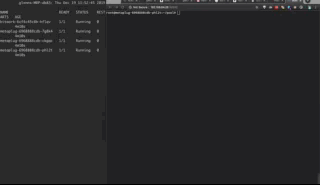

# metaplug


#### a pluggable application framework for the metanet


### What is this?

Metaplug provides a pluggable app framwork to interact with your metanet file system. This can be used for:
- *DESIGN*: experiment with metanet in various operating environments, in real time.
- *PUBLISH*: define onchain fully replicable bitcoin based apps.

### Why?
In the future it may make sense for bitcoin nodes (miners) to host applications, and become providers for general compute, since they will already be storing all the data. In this scenario, developers may want a convienient way to clearly define how their application logic interacts with the underlying data, in a easily replicatable way. 

### How?
Bitplug relies on [Bitwork](https://www.bitwork.network/#/) to listen and process data from Bitcoin's P2P network. Application logic is packaged as a container and can mount various bitcoin based data structures (such as [Bitcom](https://bitcom.bitdb.network/#/) namespaces) to generate applications. These can be easily defined and distributed through Kubernetes chart definitions, which are replicatable across cloud environements, or even on premise hardware. To do this, metaplug uses [helm packages](https://helm.sh/) which provide simple idempotent installs, as well as versioned packages which can be stored and pulled from on-chain. 

### Try a demo:

The demo application included allows a user to explore bitcom-based transactions ('B' protocol by default) in a web terminal. Keep in mind, this application is only to demonstrate how the framework can be used.



You'll need a  Kubernetes environment (I'm using minikube running locally for demo)

**Quickstart:**

```
cd metaplug/templates
kubectl apply -f namespace.yaml
kubectl apply -f bitwork.yaml
kubectl apply -f metaplug.yaml
kubectl get pods --namespace metaplug
minikube service metaplug-http --namespace metaplug
```
Can also be done with:
```
helm package metaplug --version 0.1.0
helm install metaplug-0.1.0.tgz --name metaplug-demo
```

**Or... Even Better, with Helm and Onchain Archives**

Once [this](https://github.com/helm/monocular/pull/643) PR is merged to fix [this](https://github.com/helm/helm/issues/2916) issue with Tiller. We will be able to run commands like this to start a bitcoin app:

```
helm install https://bico.media/d0b9e83544d1048c891069be47592279facec70b29bfa45826de1286646429d9 --name metaplug-demo
``` 

where, `d0b9e83544d1048c891069be47592279facec70b29bfa45826de1286646429d9` is a gzip helm archive, produced by `helm package` command.

### Further Thoughts...

Keep in mind this is simply an example implementation for a bitcoin-based application framework - to provide replicable application interfaces to the bitcoin backend. 


